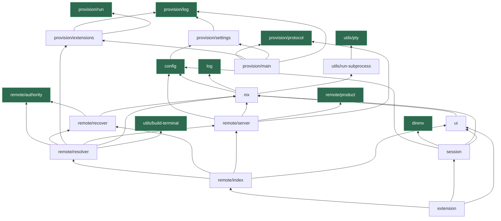

# Class structure

The extension is mostly modules of functions; only four types are stateful enough to be
classes (`DevShellSession`, `StatusBar`, `ServerManager`, `NixDevShellResolver`). The
diagram shows every exported type, with modules that are pure function sets drawn as
`<<module>>` so the boundaries of the real design stay visible.

Read it with the dependency graph in mind: the leaves (`config`, `log`, `direnv`,
`authority`, `product`) know nothing about the rest, `nix` owns every way to invoke Nix,
and `remote/*` is the only part that knows what a server is.

And read `provision/*` as a separate program. It is bundled on its own as
`dist/provision.js` and runs inside `nix develop`, so nothing in it may import `vscode` —
which is why it carries its own `log`, its own `run`, and `protocol`, the only thing both
bundles share.

```mermaid
classDiagram
    direction TB

    %% ---------------------------------------------------------------- leaves

    class config {
        <<module>>
        +SECTION: string
        +readConfig(scope) NixDevShellConfig
        +flakeDir(folder, cfg) string
        +setResolverAvailable(value)
        +isResolverAvailable() boolean
    }

    class NixDevShellConfig {
        <<interface>>
        +flakeDirectory: string
        +promptWhenUnset: boolean
        +impure: boolean
        +extraArgs: string[]
        +nixPath: string
        +buildTimeoutSeconds: number
        +showBuildOutput: BuildOutputMode
        +remote: RemoteConfig
    }

    class RemoteConfig {
        <<interface>>
        +serverDownloadUrl: string
        +connectTimeoutSeconds: number
        +patchServerLd: boolean
    }

    class log {
        <<module>>
        +initLog() LogOutputChannel
        +info(msg) void
        +warn(msg) void
        +error(msg) void
        +debug(msg) void
        +show() void
    }

    class direnv {
        <<module>>
        +detectDirenv(dir) DirenvState
    }

    class DirenvState {
        <<interface>>
        +present: boolean
        +usesFlake: boolean
        +allowed: boolean
        +devShell?: string
    }

    %% ------------------------------------------------------------------- nix

    class nix {
        <<module>>
        -FEATURE_ARGS: string[]
        +BUILD_LOG_FORMAT: string
        -DUMP_SCRIPT: string
        -ANSI_CSI: RegExp
        -systemDouble: string
        -pathRefDirs: Set~string~
        +run(exe, args, opts) RunResult
        +nixCommand(cfg, subcommand, args, opts) NixCommand
        +developCommand(cfg, opts) NixCommand
        +currentSystem(cfg, cwd, token) string
        +primeCurrentSystem(value) void
        +listDevShells(cfg, dir, system, token) DevShell[]
        +flakeRefFor(dir) string
        +markPathRefRequired(dir) void
        +isUntrackedFlakeError(err) boolean
        +isEvaluationError(err) boolean
        +nixErrorSummary(err) string
        +nixErrorLocations(err) NixErrorLocation[]
        +toInstallable(selection, dir, system) string
        +plainText(line) string
    }

    class NixCommand {
        <<interface>>
        +exe: string
        +args: string[]
    }

    class NixErrorLocation {
        <<interface>>
        +file: string
        +line: number
        +column: number
    }

    class DevelopOptions {
        <<interface>>
        +installable: string
        +profile: string | undefined
        +command: string[]
        +logFormat?: string
    }

    class CaptureOptions {
        <<interface>>
        +token?: CancellationToken
        +onProgress?: fn(line)
        +onOutput?: fn(chunk)
        +tty?: TtyOptions
    }

    class BuildTerminal {
        -writer: EventEmitter~string~
        -resizer: EventEmitter~Dimensions~
        -terminal: Terminal
        -backlog: string
        -live: boolean
        -closed: boolean
        -size?: Dimensions
        +dimensions: Dimensions | undefined
        +onDidChangeDimensions: Event~Dimensions~
        +write(chunk) void
        +reveal() void
        +dispose() void
    }

    class pty {
        <<module>>
        -cached?: PtyModule
        +loadPty() PtyModule | undefined
        +forgetPty() void
    }

    class PtyModule {
        <<interface>>
        +spawn(file, args, options) PtyProcess
    }

    class TtyOptions {
        <<interface>>
        +columns?: number
        +rows?: number
        +onResize?: Event~Dimensions~
    }

    class DevShell {
        <<interface>>
        +name: string
        +derivationName?: string
        +description?: string
    }

    class NixError {
        +stderr: string
        +code: number
    }

    %% --------------------------------------------------------------- session

    class DevShellSession {
        -context: ExtensionContext
        -folder: WorkspaceFolder
        -status: StatusBar
        -onFlakeChanged() Promise
        -systemCache?: string
        -shellCache?: StampedShells
        -warnedSlow: boolean
        -flakePresent: boolean
        +workspaceFolder: WorkspaceFolder
        +dir() string
        +hasFlake() boolean
        +promptForDevShell() Selection
        +activate(opts) void
        -devShells(cfg) DevShell[]
        -flakeStamp() string
        -warnSlowEvaluation(elapsed) void
        -offerSelection() void
        -watchFlake() void
        -flakeChanged(names) void
        +dispose() void
    }

    class StatusBar {
        -item: StatusBarItem
        +set(state: StatusState) void
        +dispose() void
    }

    %% ------------------------------------------------------------ remote/leaf

    class authority {
        <<module>>
        +AUTHORITY_PREFIX: string
        -B32: string
        -SEP: string
        +authorityFor(target) string
        +authorityId(authority) string
        +decodeAuthority(authority) RemoteTarget
        +storageKeyFor(authority) string
    }

    class RemoteTarget {
        <<interface>>
        +folder: string
        +flakeDir: string
        +devShell: string
    }

    class product {
        <<module>>
        -MICROSOFT: ClientProduct
        -MICROSOFT_SERVER_URL: string
        -cached?: ClientProduct
        +clientProduct(appRoot) ClientProduct
        +readProduct(appRoot) ClientProduct
        +forgetProduct() void
        +serverOsArch() OsArch
        +serverDownloadUrl(product, commit, configured) string
    }

    class ClientProduct {
        <<interface>>
        +serverApplicationName: string
        +serverDataFolderName: string
        +dataFolderName: string
        +serverDownloadUrlTemplate?: string
        +quality: string
        +version: string
        +nameLong: string
    }

    %% ------------------------------------------------------- remote/services

    class ServerManager {
        -globalStorage: Uri
        -cfg: NixDevShellConfig
        -productOnce?: Promise~ClientProduct~
        +ensureServer(commit, progress) string
        +patchServerNode(launcher, dir) PatchedNode
        +findRunning(key, commit) ServerHandle
        +start(opts) ServerHandle
        +stop(key) boolean
        +sweep() number
        -root: string
        -serverDir(commit) string
        -launcherIn(dir) string
        -product() ClientProduct
        -findExistingServer(commit) string
        -lockPath(key) string
        -readLock(key) LockFile
        -release(key, lock) void
        -connectTimeoutSeconds: number
    }

    class ServerHandle {
        <<interface>>
        +port: number
        +connectionToken: string
        +pid: number
    }

    class PatchedNode {
        <<interface>>
        +patched: boolean
        +node: string
        +linker?: string
        +rpath?: string
    }

    %% ------------------------------------------------- provision (2nd bundle)

    class protocol {
        <<module>>
    }

    class ProvisionOptions {
        <<interface>>
        +launcher: string
        +extensionsDir: string
        +serverDataDir: string
        +flakeDir: string
        +lockFile: string
        +connectionToken: string
        +commit: string
        +installable: string
        +connectTimeoutSeconds: number
        +installTimeoutSeconds: number
    }

    class LockFile {
        <<interface>>
        +port: number
        +connectionToken: string
        +pid: number
        +installable: string
        +commit: string
        +startedAt: number
    }

    class provisionMain {
        <<module>>
        -main() void
        -startServer(opts) void
        -awaitListening(child, timeout) Listening
    }

    class extensions {
        <<module>>
        +FLAKE_EXTENSION_VARS: string[]
        +collectExtensions(devShellEnv) DeclaredExtensions
        +installedIn(extensionsDir) string[]
        +ensureInstalled(opts) InstallResult
        +extensionsDirFor(root, key) string
        +resolveNixExtensions(storePaths) NixExtension[]
        +syncNixExtensions(extensionsDir, wanted) SyncResult
        +installDeclaredExtensions(opts) void
    }

    class DeclaredExtensions {
        <<interface>>
        +ids: string[]
        +paths: string[]
    }

    class NixExtension {
        <<interface>>
        +id: string
        +path: string
    }

    class `extensions-manifest` {
        <<module>>
        +manifestPath(extensionsDir) string
        +syncManifest(extensionsDir, linked, unlinked) RecordResult
    }

    class settings {
        <<module>>
        +FLAKE_SETTINGS_VARS: string[]
        +parseFlakeSettings(raw, source) SettingsMap
        +collectSettings(devShellEnv) SettingsMap
        +machineSettingsPath(serverDataDir) string
        +parseJsonc(text) SettingsMap
        +readMachineSettings(serverDataDir) SettingsMap
        +applyMachineSettings(serverDataDir, values) ApplyResult
        +applyDeclaredSettings(opts) void
    }

    %% -------------------------------------------------------------- resolver

    class NixDevShellResolver {
        -context: ExtensionContext
        +resolve(authority, context) ResolverResult
        +getCanonicalURI(uri) Uri
        -startOrAttach(authority, target, progress) ResolverResult
        -startFresh(opts) ResolverResult
        -provisionScript() string
    }

    class RemoteAuthorityResolver {
        <<interface>>
        +resolve(authority, context)
        +getCanonicalURI(uri)
    }

    class remoteIndex {
        <<module>>
        +inDevShellWindow() boolean
        +reopenInDevShell(folder, devShell, flakeDir) void
        +reopenLocally() void
        +killServer(context, folder) void
        +switchDevShellInRemoteWindow(context) void
        +offerExtensionSync(context) void
    }

    class flakeWatch {
        <<module>>
        -FLAKE_FILES: string[]
        -SETTLE_MS: number
        -digest(dir) string
        +watchDevShellFlake(context, status, active) Disposable
        +restartDevShellWindow(context) void
    }

    class recover {
        <<module>>
        -PENDING_KEY: string
        -PENDING_TTL_MS: number
        +offerLocalRecovery(context, target, locations, summary) void
        +reopenFolderLocally(folder) void
        +openPendingFile(context) boolean
        +errorSite(locations, flakeDir) NixErrorLocation
        -inCheckout(file, flakeDir) string
    }

    class extension {
        <<module>>
        -sessions: Map~string,DevShellSession~
        -statusBar: StatusBar
        +activate(context) void
        +deactivate() void
        -flakeChanged() Promise
        -anyFlake() boolean
        -refreshStatus() void
        -registerResolver(context) void
        -syncSessions(context) void
        -resolveSession(prompt) DevShellSession
        -pickFolder(prompt) WorkspaceFolder
    }

    %% --------------------------------------------------------- compositions

    NixDevShellConfig *-- RemoteConfig
    DirenvState <.. direnv : returns
    NixDevShellConfig <.. config : returns

    nix ..> NixCommand : builds
    nix ..> DevelopOptions : takes
    nix ..> DevShell : returns
    nix ..> NixError : throws
    nix ..> NixErrorLocation : returns
    nix ..> NixDevShellConfig : reads

    DevShellSession --> StatusBar : reports to
    DevShellSession ..> nix : lists shells
    DevShellSession ..> direnv : picker default
    DevShellSession ..> config

    flakeWatch ..> authority : decodes this window
    flakeWatch --> StatusBar : marks stale
    flakeWatch ..> ServerManager : stops before reload

    recover ..> RemoteTarget : the folder to go back to
    recover ..> NixErrorLocation : picks one to open

    authority ..> RemoteTarget
    product ..> ClientProduct

    ServerManager ..> product : launcher name, download URL
    ServerManager ..> nix : develop
    ServerManager ..> ServerHandle : returns
    ServerManager ..> ProvisionOptions : writes into argv
    ServerManager ..> LockFile : reads
    ServerManager ..> provisionMain : runs, inside the shell
    protocol ..> ProvisionOptions
    protocol ..> LockFile

    provisionMain ..> ProvisionOptions : its one argument
    provisionMain ..> LockFile : writes
    provisionMain --> extensions
    provisionMain --> settings

    extensions ..> NixExtension
    extensions --> `extensions-manifest`
    extensions ..> DeclaredExtensions

    NixDevShellResolver ..|> RemoteAuthorityResolver
    NixDevShellResolver --> ServerManager : owns per resolve
    NixDevShellResolver ..> authority : decode, storage key
    NixDevShellResolver ..> extensions : extensionsDirFor
    NixDevShellResolver ..> nix : currentSystem, toInstallable
    NixDevShellResolver ..> PatchedNode

    remoteIndex ..> authority
    remoteIndex ..> ServerManager
    remoteIndex ..> nix

    extension --> DevShellSession : one per folder
    extension --> StatusBar
    extension ..> NixDevShellResolver : registers
    extension ..> remoteIndex
```

## What the shapes mean

**Two lifetimes, not one.** `DevShellSession` exists per local workspace folder and only
ever *chooses* a devShell; `NixDevShellResolver` exists per window and only ever *realises*
one. They never call each other. The handoff between them is not an object reference but a
URI: the session hands a name to `reopenInDevShell`, which encodes it into an authority and
asks VS Code to open a window, and the resolver in that new window decodes it back. The
only thing a session calls back into `extension` for is `onFlakeChanged` — a single
callback, not an interface — because re-deriving the shared `when`-clause contexts and the
one status bar is the only decision a folder cannot make alone.

**`ServerManager` is constructed per resolve, not held.** It owns no server state; the lock
file on disk does. Two windows resolving the same authority build two managers that agree
because they read the same `<globalStorage>/server/instances/<key>.json`.

**`provision/*` is a second program, not a layer.** It is bundled separately and runs in a
different process, inside `nix develop`, started by the server's own `node`. The arrow from
`ServerManager` to it is a process boundary: options go across as one JSON argument, and
the only things that come back are the lock file and an exit code. That is also why
`protocol` has no imports at all — it is linked into both bundles, and one of them has no
`vscode` to pull in. `extensions` and `settings` live on that side because that is where
they run; the extension host borrows `extensionsDirFor` and `installedIn` from them, which
is the only traffic in the other direction.

**`nix` is the only module that spells a Nix flag.** `nixCommand` and `developCommand` are
the whole surface; `ServerManager` takes argv from them rather than assembling its own, so
"how this extension invokes Nix" has exactly one definition.

**`remoteIndex` is `remote/index.ts`,** which is both the barrel the rest of the code
imports `remote` through *and* the home of the window commands and the two document
renderers. That is a known wrinkle rather than a design: see K5 in [../REVIEW.md](../REVIEW.md).

**`authority` is a codec, not a registry.** `authorityFor`/`decodeAuthority` round-trip the
target through the URI itself, so there is no table mapping ids to meanings and nothing to
fall out of sync when an entry in "recently opened" outlives a restart.

## Module dependency graph

No cycles. Arrows point at what a module depends on, so the leaves are at the bottom.
