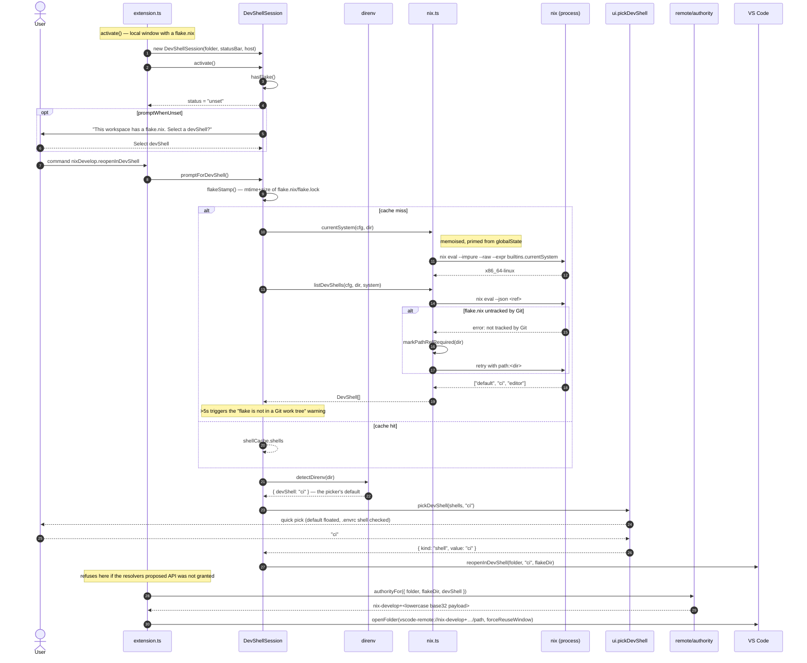
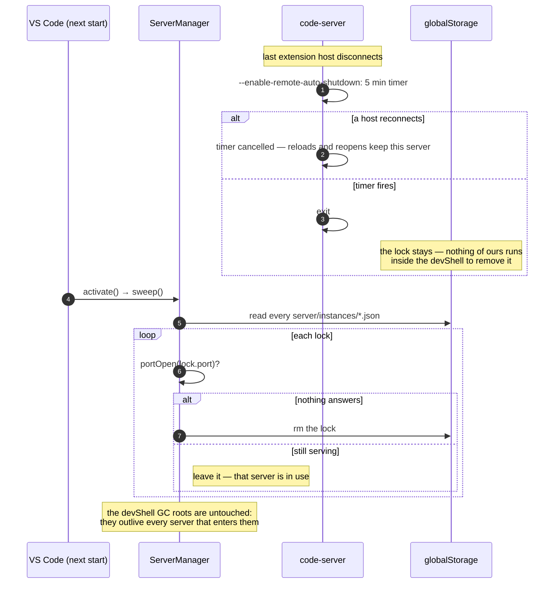

# Opening a devShell window

From clicking a devShell in the picker to an extension host running inside `nix develop`.

The interesting thing about this flow is that it crosses a **window boundary** in the
middle. The picker runs in the local window; everything after `vscode.openFolder` runs in a
*different* window, which starts from nothing but the authority string. Nothing is passed
in memory across that line — the authority is the entire handoff.

## Phase 1 — choosing, in the local window



Base32, not base64url, because VS Code lower-cases an authority restored from persisted
state and a URI authority is case-insensitive by RFC 3986. The payload *is* the target, so
there is no side table to outlive.

## Phase 2 — resolving, in the new window

```mermaid
sequenceDiagram
    autonumber
    participant Code as VS Code (client)
    participant Res as NixDevelopResolver
    participant Auth as remote/authority
    participant SM as ServerManager
    participant Prod as remote/product
    participant Nix as nix.ts
    participant NixCLI as nix (process)
    participant FS as globalStorage
    participant Extn as remote/extensions
    participant Set as remote/settings
    participant Term as BuildTerminal
    participant Server as code-server

    Code->>Res: resolve("nix-develop+…", { resolveAttempt })
    Res->>Auth: decodeAuthority(authority)
    alt payload does not decode
        Auth-->>Res: undefined
        Res-->>Code: NotAvailable("reopen locally and pick again")
    end
    Auth-->>Res: { folder, flakeDir, devShell }
    Res->>Code: withProgress("Nix devShell: ci")

    Res->>Auth: storageKeyFor(authority)
    Auth-->>Res: <16 hex chars>
    Res->>SM: new ServerManager(globalStorageUri, cfg)

    rect rgb(30, 60, 45)
        Note over Res,FS: Fast path — is one already running?
        Res->>SM: findRunning(key, commit)
        SM->>FS: read server/instances/<key>.json
        SM->>SM: portOpen(lock.port)?
        alt port answers and commit matches
            SM-->>Res: ServerHandle { port, token, pid }
            Res-->>Code: ResolvedAuthority(127.0.0.1, port, token)
            Note over Code: done — no Nix, no build, no download
        else port dead
            SM->>FS: release() — delete the lock (the profile is the project's, and stays)
            Note right of SM: a lock naming a dead port —<br/>the server retired, or was killed
            SM-->>Res: undefined
        end
    end

    rect rgb(40, 45, 70)
        Note over Res,Server: Cold path
        Res->>Term: new BuildTerminal("nix develop: ci")
        Note right of Term: only past the attach: a window landing on a<br/>running server builds nothing<br/>(skipped when showBuildOutput is never)
        Res->>SM: ensureServer(commit, progress)
        SM->>Prod: clientProduct() — read the editor's product.json
        Prod-->>SM: { serverApplicationName, serverDataFolderName, … }
        SM->>FS: launcherIn(server/<commit>)
        alt not on disk
            SM->>SM: findExistingServer(commit)
            Note right of SM: ~/.vscode-server/bin/<commit>,<br/>CLI servers/<quality>-<commit>
            alt still nothing
                SM->>Prod: serverDownloadUrl(product, commit, configured)
                SM->>SM: download + tar -xzf + distributionRoot()
                Note right of SM: flat unpack, then find the real root:<br/>MS wraps, VSCodium does not
            end
        end
        SM-->>Res: <launcher path>

        Res->>SM: patchServerNode(launcher, flakeDir)
        alt nixDevelop.remote.patchServerLd = false
            Note right of SM: nothing is built and nothing is written;<br/>the host resolves /lib64/ld-linux-* itself
        else patching (the default)
            SM->>Nix: nixCommand(build --no-link --print-out-paths)
            Nix->>NixCLI: nix build nixpkgs#glibc.out
            Nix->>NixCLI: nix build nixpkgs#gcc-unwrapped.lib
            Nix->>NixCLI: nix build nixpkgs#patchelf.out
            SM->>SM: glibcLinkerName(process.arch)
            SM->>SM: patchelf --print-interpreter / --print-rpath (skip if already patched)
            SM->>SM: patchelf --set-rpath then --set-interpreter on a copy, renamed over <root>/node
            Note right of SM: the extension patches, not bin/code-server, so no<br/>VSCODE_SERVER_CUSTOM_GLIBC_* reaches the server:<br/>no "unsupported OS" banner, and a busy node is<br/>swapped rather than rewritten
        end
        SM-->>Res: PatchedNode { patched, node, linker?, rpath? }
    end
    Note over Res: done before anything runs the launcher —<br/>installing extensions starts the same node

    Res->>Nix: currentSystem(cfg, flakeDir)
    Res->>Nix: toInstallable("ci", flakeDir, system)
    Nix-->>Res: /path#devShells.x86_64-linux.ci
    Note over Res: paths derived from the storage key:<br/>remote/extensions/<key>, remote/data/<key>
    Res->>FS: ensureProfile(cfg, folder, devShell)<br/><folder>/.vscode/nix-develop/<devShell>/devshell + .gitignore<br/>(undefined when nixDevelop.profile is none)

    rect rgb(60, 50, 30)
        Note over Res,NixCLI: One capture serves extensions and settings
        Res->>Nix: captureEnv(cfg, installable, flakeDir, profile, { onOutput, tty })
        Note right of Res: tty carries the terminal's width —<br/>Nix lays its progress bar out for it
        Nix->>NixCLI: bash -c DUMP_SCRIPT (baseline, no devShell)
        Nix->>Nix: developCommand(...) — mkdir profile dir
        Nix->>Nix: loadPty() — the editor's node-pty from <appRoot>, or nothing
        Nix->>NixCLI: nix --log-format bar-with-logs develop <installable> --profile <p> --command bash -c DUMP_SCRIPT
        Note right of NixCLI: under a pty when one was lent, so isatty()<br/>is true and Nix draws its bar in colour;<br/>over a pipe otherwise, same logs, no colour
        Note right of NixCLI: builds the devShell<br/>--profile makes it a GC root that stays<br/>until the user deletes .vscode/nix-develop
        NixCLI-->>Nix: stdout + stderr, streamed
        Nix->>Term: write(chunk) — verbatim, CRLF-corrected, nothing of ours added
        Nix-->>Res: onProgress(line) — same stream, ANSI stripped
        NixCLI-->>Nix: NUL-delimited env, written to a temp file
        Nix-->>Res: CaptureResult { inside, baseline }
        Note over Res: a failure here is logged, not fatal —<br/>the window opens without what the flake declared
    end

    Res->>Extn: collectExtensions(capture.inside)
    Note right of Extn: 'vscodeExtensions', split into store paths and Marketplace ids
    Res->>Extn: resolveNixExtensions(declared.paths)
    Res->>Extn: syncNixExtensions(extensionsDir, nixExtensions)
    Extn->>FS: symlinks + extensions.json + .obsolete
    Note right of Extn: the server loads what extensions.json lists,<br/>not what the directory holds
    Res->>Extn: ensureInstalled({ launcher, extensionsDir, wanted: declared.ids })
    Extn->>Server: <launcher> --install-extension <id> (once per missing id)
    Note right of Extn: the first thing to run the launcher, on a node<br/>that patchServerNode has already dealt with

    Res->>Set: collectSettings(cfg, capture.inside) + mergedSettings()
    Res->>Set: applyMachineSettings(serverDataDir, values)
    Set->>FS: write data/Machine/settings.json + nix-develop.managed.json
    Note right of Set: before the server starts, so the host<br/>reads them on its first pass

    rect rgb(45, 30, 60)
        Note over Res,Server: Start the server inside the shell
        Res->>SM: start({ key, commit, launcher, installable, profile, dirs })
        SM->>SM: connectionToken = randomUUID()
        SM->>Nix: developCommand(cfg, { installable, profile, command: [<launcher>, --start-server, …] })
        Nix-->>SM: { exe: nix, args: [--extra-experimental-features …, develop, …] }
        SM->>Server: spawn(detached, nix develop … --command <launcher> --start-server …)
        Note right of Server: nix develop --command *execs*,<br/>so the launcher keeps the spawned pid —<br/>nothing of ours sits in between
        Server-->>SM: stdout "Extension host agent listening on 41263"
        SM->>SM: awaitListening() resolves, then child.unref()
        SM->>FS: write server/instances/<key>.json { port, token, pid, commit, profile }
        SM-->>Res: ServerHandle
    end

    Res-->>Code: ResolvedAuthority(127.0.0.1, port, token)<br/>+ extensionHostEnv NIX_DEVELOP_SHELL/_FLAKE, isTrusted
    Code->>Server: connect, fork the remote extension host
    Note over Server: the host — and every terminal, task,<br/>debugger and language server it spawns —<br/>is a child of a process inside nix develop

    Code->>Res: getCanonicalURI(uri) → file:// form
    Note right of Res: remote and local URIs address the same disk,<br/>so recently-opened and SCM see one file, not two
```

A throw inside `startOrAttach` is classified before it leaves `resolve`. Anything Nix could
plausibly do differently next time -- a download, a builder, a port that never opened --
becomes `TemporarilyNotAvailable`, so VS Code offers a retry instead of dropping the window
into an unrecoverable state. A failure to *evaluate* the flake (`isEvaluationError`) becomes
`NotAvailable` carrying `nixErrorSummary`, because the retry that code asks for would re-run
an evaluation that fails identically every time: the window would loop rather than land
anywhere the user could act on. A throw also reveals the
build terminal, so the one-line notification has the output that led to it sitting beside
it -- the message is not written in there, only Nix's own output ever is. On success the
terminal is disposed unless `nixDevelop.showBuildOutput` is `always`, which was a request to
keep watching.

## Phase 3 — the window is up


## Teardown

Nothing asks the server to exit, so it settles that itself.



`ServerManager.stop` (the `Stop devShell server` command) and `findRunning` clear the one
lock they are about — the first for an explicit stop, the second when the lock it just read
names a dead port. `sweep` is what clears the rest. All three are idempotent, so the order
they arrive in does not matter, and a lock that outlives its server is inert until one of
them gets to it: every reader tests the port before trusting what the lock says.

## The three places state lives

| Where | What | Lifetime |
| --- | --- | --- |
| The authority | folder, flakeDir, devShell | as long as the window or its "recently opened" entry |
| `server/instances/<key>.json` | port, connection token, pid, commit, profile | until a sweep, a stop or a findRunning collects it |
| `<folder>/.vscode/nix-develop/<devShell>/devshell` | the Nix GC root for the built shell | until the user deletes it (`nixDevelop.profile: none` writes none) |

Nothing else persists. There is no setting recording the selection, and no registry mapping
ids back to targets — which is what makes a restart, a reload and a fresh open all follow
the same path through Phase 2.
