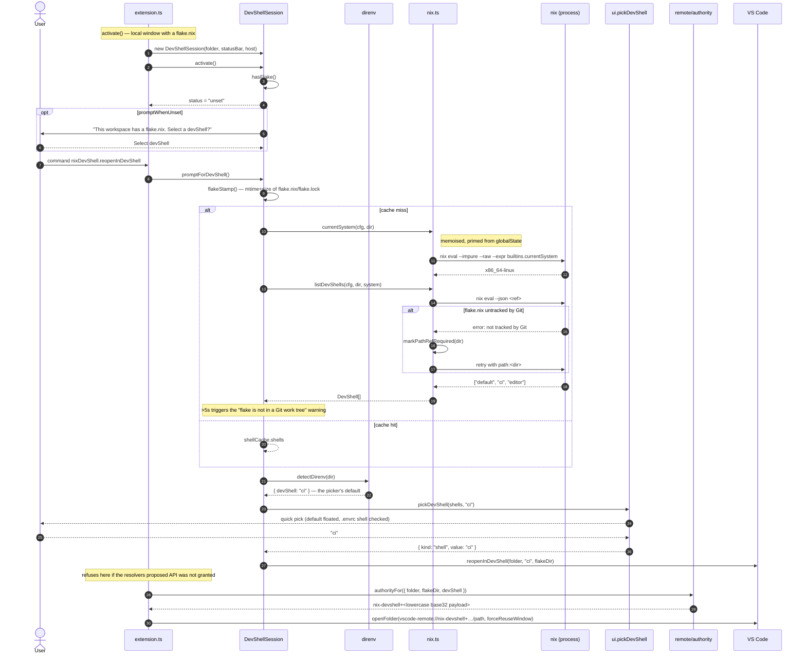
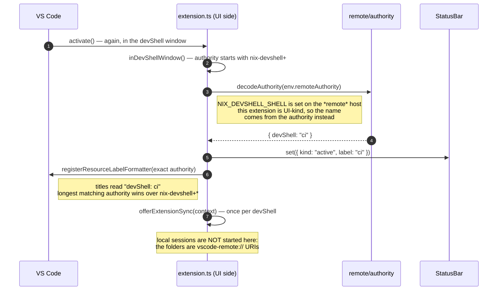
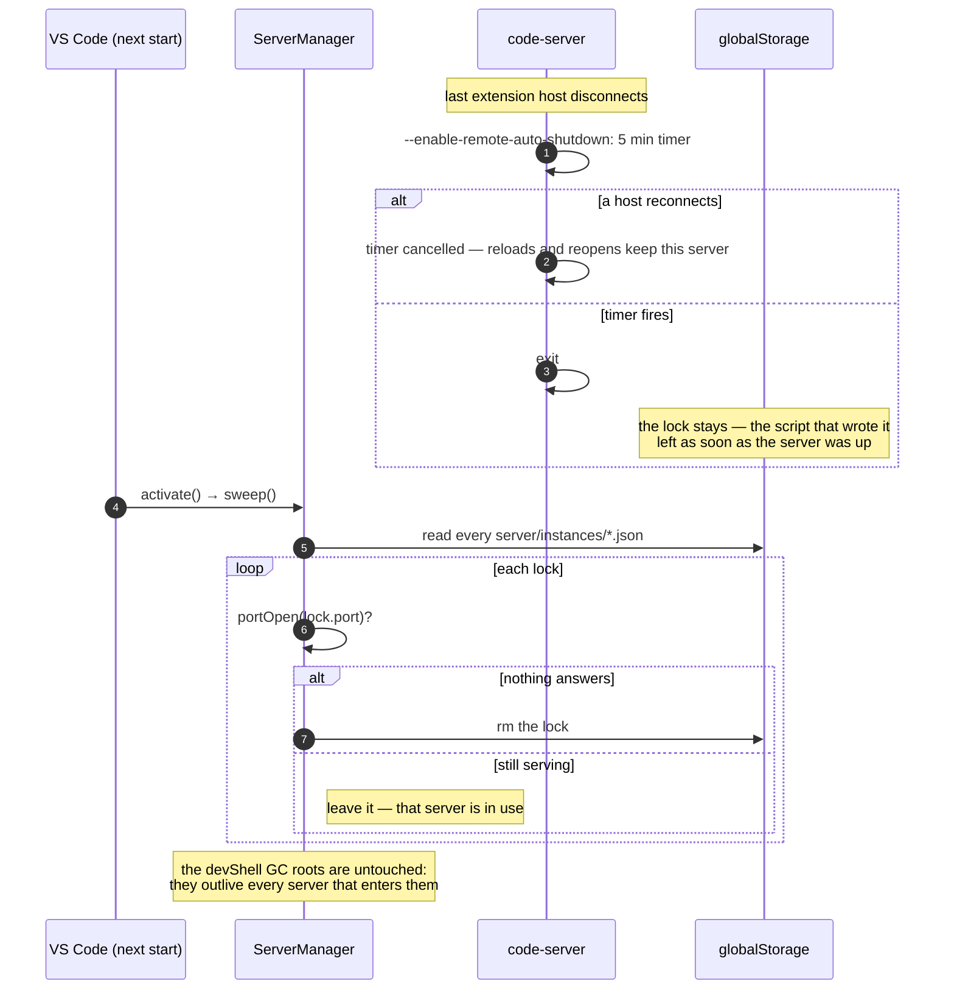

# Opening a devShell window

From clicking a devShell in the picker to an extension host running inside `nix develop`.

The interesting thing about this flow is that it crosses a **window boundary** in the
middle. The picker runs in the local window; everything after `vscode.openFolder` runs in a
*different* window, which starts from nothing but the authority string. Nothing is passed
in memory across that line — the authority is the entire handoff.

## Phase 1 — choosing, in the local window

Base32, not base64url, because VS Code lower-cases an authority restored from persisted
state and a URI authority is case-insensitive by RFC 3986. The payload *is* the target, so
there is no side table to outlive.

## Phase 2 — resolving, in the new window

```mermaid
sequenceDiagram
    autonumber
    participant Code as VS Code (client)
    participant Res as NixDevShellResolver
    participant Auth as remote/authority
    participant SM as ServerManager
    participant Prod as remote/product
    participant Nix as nix.ts
    participant NixCLI as nix (process)
    participant FS as globalStorage
    participant Term as BuildTerminal
    participant Prov as provision.js (in the shell)
    participant Server as code-server

    Code->>Res: resolve("nix-devshell+…", { resolveAttempt })
    Res->>Auth: decodeAuthority(authority)
    alt payload does not decode
        Auth-->>Res: undefined
        Res-->>Code: NotAvailable("reopen locally and pick again")
    end
    Auth-->>Res: { folder, flakeDir, devShell }
    Res->>Code: withProgress("Nix devShell: ci")

    Res->>Auth: storageKeyFor(authority)
    Auth-->>Res: <16 hex chars>
    Res->>SM: new ServerManager(globalStorageUri, cfg)

    rect rgb(30, 60, 45)
        Note over Res,FS: Fast path — is one already running?
        Res->>SM: findRunning(key, commit)
        SM->>FS: read server/instances/<key>.json
        SM->>SM: portOpen(lock.port)?
        alt port answers and commit matches
            SM-->>Res: ServerHandle { port, token, pid }
            Res-->>Code: ResolvedAuthority(127.0.0.1, port, token)
            Note over Code: done — no Nix, no build, no download
        else port dead
            SM->>FS: release() — delete the lock (the profile is the project's, and stays)
            SM-->>Res: undefined
        end
    end

    rect rgb(40, 45, 70)
        Note over Res,Server: Cold path — everything below happens before the shell is entered
        Res->>Term: new BuildTerminal("nix develop: ci")
        Note right of Term: only past the attach: a window landing on a<br/>running server builds nothing<br/>(skipped when showBuildOutput is never)
        Res->>SM: ensureServer(commit, progress)
        SM->>Prod: clientProduct() — read the editor's product.json
        Prod-->>SM: { serverApplicationName, serverDataFolderName, … }
        SM->>FS: launcherIn(server/<commit>)
        alt not on disk
            SM->>SM: findExistingServer(commit)
            Note right of SM: ~/.vscode-server/bin/<commit>,<br/>CLI servers/<quality>-<commit>
            alt still nothing
                SM->>Prod: serverDownloadUrl(product, commit, configured)
                SM->>SM: download + tar -xzf + distributionRoot()
            end
        end
        SM-->>Res: <launcher path>

        Res->>SM: patchServerNode(launcher, flakeDir)
        alt nixDevShell.remote.patchServerLd = false
            Note right of SM: nothing is built and nothing is written --<br/>the host resolves /lib64/ld-linux-* itself
        else patching (the default)
            SM->>NixCLI: nix build nixpkgs#glibc.out / gcc-unwrapped.lib / patchelf.out
            SM->>SM: patchelf --set-rpath then --set-interpreter on a copy, renamed over <root>/node
            Note right of SM: the same node runs provision.js a moment later,<br/>so this has to be settled first
        end
        SM-->>Res: PatchedNode { patched, node, linker?, rpath? }

        Res->>Nix: currentSystem(cfg, flakeDir)
        Res->>Nix: toInstallable("ci", flakeDir, system)
        Nix-->>Res: /path#devShells.x86_64-linux.ci
        Res->>FS: ensureProfile(cfg, folder, devShell)<br/><folder>/.vscode/nix-devshell/<devShell>/devshell + .gitignore
        Note over Res: paths derived from the storage key:<br/>remote/extensions/<key>, remote/data/<key>
    end

    rect rgb(60, 50, 30)
        Note over Res,Server: One `nix develop`, from here to a listening server
        Res->>SM: start({ key, commit, launcher, installable, profile, dirs, provisionScript })
        SM->>SM: connectionToken = randomUUID()
        SM->>FS: rm the stale lock, so what is read back is this run's
        SM->>Nix: developCommand(… --command <node> provision.js '<ProvisionOptions JSON>')
        Nix-->>SM: { exe: nix, args: […, develop, …, --command, …] }
        SM->>NixCLI: run(nix --log-format bar-with-logs develop … ), under the editor's pty
        Note right of NixCLI: builds the devShell<br/>--profile makes it a GC root that stays<br/>until the user deletes .vscode/nix-devshell
        NixCLI-->>Term: every byte, verbatim, CRLF-corrected
        NixCLI-->>SM: the same stream, a line at a time, for the progress notification

        NixCLI->>Prov: exec <node> provision.js '<options>'
        Note right of Prov: it *is* the devShell, so vscodeExtensions<br/>and vscodeSettings are just process.env
        Prov->>Prov: collectExtensions(process.env)
        Prov->>FS: syncNixExtensions — symlinks + extensions.json + .obsolete
        Prov->>Server: <launcher> --install-extension <id> (once per missing id)
        Prov->>FS: applyMachineSettings — data/Machine/settings.json + nix-devshell.managed.json
        Prov->>Server: spawn(detached, <launcher> --start-server --port 0)
        Note right of Server: a session of its own, so closing the pty<br/>cannot SIGHUP it, and its pid leads the<br/>process group that stop signals
        Server-->>Prov: stdout "Extension host agent listening on 41263"
        Prov->>Prov: drop the pipes — the server keeps its own logs<br/>under serverDataDir/data/logs
        Prov->>FS: write server/instances/<key>.json { port, token, pid, commit, installable }
        Prov-->>NixCLI: exit 0
        NixCLI-->>SM: exit 0
        SM->>FS: read the lock back
        SM-->>Res: ServerHandle
        Note over Term: disposed unless showBuildOutput is always —<br/>nothing of ours is still holding the pty
    end

    Res-->>Code: ResolvedAuthority(127.0.0.1, port, token)<br/>+ extensionHostEnv NIX_DEVSHELL_SHELL/_FLAKE, isTrusted
    Code->>Server: connect, fork the remote extension host
    Note over Server: the host — and every terminal, task,<br/>debugger and language server it spawns —<br/>is a child of a process that was inside nix develop

    Code->>Res: getCanonicalURI(uri) → file:// form
    Note right of Res: remote and local URIs address the same disk,<br/>so recently-opened and SCM see one file, not two
```

One `nix develop`, not two. The extension used to enter the shell once with a script that
dumped its environment into a temp file — which it parsed out here to learn what
`vscodeExtensions` and `vscodeSettings` said — and then enter it a second time to start the
server. Everything between those two entries now runs *in* the shell as `provision.js`,
where the environment needs no shipping because it is simply the environment. What is left
in the extension host is what has to be true before the shell is entered at all: a server
on disk, a `node` that can start, the installable, and the directories.

The script answers in two parts, and neither is scraped out of the stream: the lock file,
and its exit code. Zero means that file describes a server that is up. So the output is
free to be nothing but output — Nix's build log and the script's own lines, going straight
to the terminal, with the progress notification reading the same stream one line at a time
because it cannot render one.

The server it leaves behind is detached, in a session of its own. That is what lets the
window let go: the pty the terminal lent Nix closes when the script exits, and a server
still on that terminal would take a SIGHUP with it. It also means the pid in the lock is
the *server's*, leading a process group of its own — which is the group `stop` signals,
rather than the group of a `nix develop` that exec'd away.

Its pipes are read only until it names its port, and then dropped. The extension host used
to hold them for the whole session, with a buffer growing behind them, and the server only
lost them when the editor quit. Dropping them early is safe for this particular child and
not in general: a bare Node process takes an uncaught `EPIPE` and dies, while the VS Code
server goes on running — checked under load that makes it log, not assumed. It has nothing
to lose there in any case, since its real logs go to `<serverDataDir>/data/logs/`, which it
opens for itself.

A throw inside `startOrAttach` is classified before it leaves `resolve`. Anything Nix could
plausibly do differently next time -- a download, a builder, a port that never opened --
becomes `TemporarilyNotAvailable`, so VS Code offers a retry instead of dropping the window
into an unrecoverable state. A failure to *evaluate* the flake (`isEvaluationError`) becomes
`NotAvailable` carrying `nixErrorSummary`, because the retry that code asks for would re-run
an evaluation that fails identically every time: the window would loop rather than land
anywhere the user could act on. A throw also reveals the build terminal, so the one-line
notification has the output that led to it sitting beside it -- the message is not written
in there, only Nix's own output and the script's ever is. On success the terminal is
disposed unless `nixDevShell.showBuildOutput` is `always`, which was a request to keep
watching.

## Phase 3 — the window is up

## Teardown

Nothing asks the server to exit, so it settles that itself.

`ServerManager.stop` (the `Stop devShell server` command) and `findRunning` clear the one
lock they are about — the first for an explicit stop, the second when the lock it just read
names a dead port. `sweep` is what clears the rest. All three are idempotent, so the order
they arrive in does not matter, and a lock that outlives its server is inert until one of
them gets to it: every reader tests the port before trusting what the lock says.

## The three places state lives

| Where | What | Lifetime |
| --- | --- | --- |
| The authority | folder, flakeDir, devShell | as long as the window or its "recently opened" entry |
| `server/instances/<key>.json` | port, connection token, the server's pid, commit, installable | until a sweep, a stop or a findRunning collects it |
| `<folder>/.vscode/nix-devshell/<devShell>/devshell` | the Nix GC root for the built shell | until the user deletes it (`nixDevShell.profile: none` writes none) |

Nothing else persists. There is no setting recording the selection, and no registry mapping
ids back to targets — which is what makes a restart, a reload and a fresh open all follow
the same path through Phase 2.
